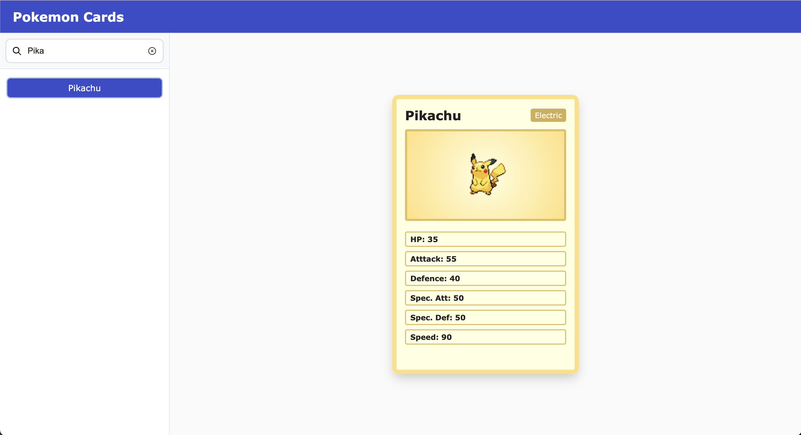

# Svelte App: Pokemon cards



## About this project

This project is built using SvelteKit, and displays Pokemon cards using data fetched from the [PokéApi](https://pokeapi.co/). You can search a list of Pokemon and pick one. The data for this Pokemon is then loaded and displayed in a Pokemon card.

## Running dev server

To run the dev server, you can run:

```bash
npm run dev --open
```

The app should then be opened on [localhost:5173/](http://localhost:5173/).

## Building

To create a production version of the app:

```bash
npm run build
```

You can preview the production build with `npm run preview`, after which the production build should be available on [localhost:4173/](http://localhost:4173/).
